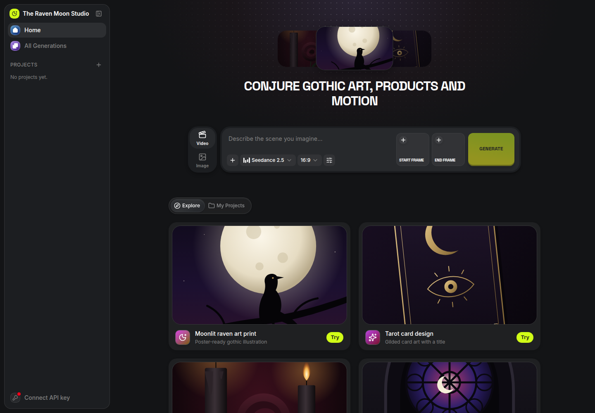
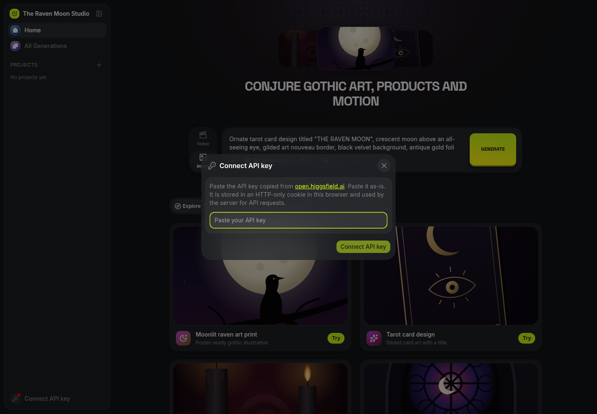
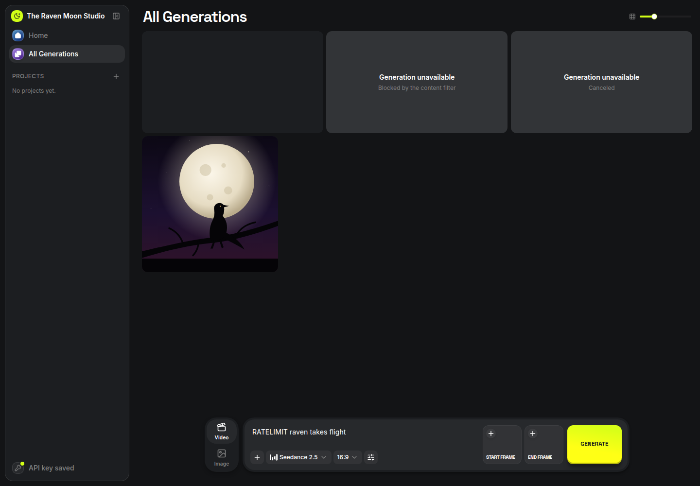

# The Raven Moon Studio

A creative studio for **The Raven Moon — Sophisticated Gothic Artistry**:
generate artwork for prints and merch, product visuals and short motion
clips with every image and video model on the
[Higgsfield API](https://open.higgsfield.ai).

Built from the official Higgsfield Studio template (Next.js 16, Tailwind v4,
shadcn), with Raven Moon branding, presets and artwork.



## Run it (3 steps)

You need [Node.js 20+](https://nodejs.org) and
[pnpm](https://pnpm.io/installation).

```sh
cd studio
pnpm install
pnpm dev
```

Open http://localhost:3000, click **Connect API key** at the bottom of the
sidebar, and paste the key copied from
[open.higgsfield.ai/api-keys](https://open.higgsfield.ai/api-keys) as-is.



No `.env` file is required. The server talks to `https://api.higgsfield.ai`
by default; set `HF_API_BASE_URL` only to point somewhere else.

## What's inside

- **Explore presets**: Moonlit raven art print, Tarot card design, Jewelry on
  black velvet, Cathedral moonlight, Candlelit product reveal and Raven takes
  flight. **Try** fills the prompt and picks a suitable model.
- **All 38 installed models**: 8 image models (Soul 2, Soul Cinema, Flux 2,
  Grok Imagine 2.0, Ideogram 4.0, Recraft 4.1, Qwen Image 3, Z-Image Turbo)
  and 30 video models (Seedance, Kling, Wan, MiniMax, LTX, PixVerse, Happy
  Horse, Grok Imagine Video, Flux 3, DoP).
- **Reference uploads** for models that take images, video or audio.
- **Projects** and a generations feed that keeps failed, blocked and canceled
  runs visible.



## How the key is handled

- The key is stored in an HTTP-only cookie. Browser code never sees it again,
  and it is never logged.
- Submit, status polling, cancel and upload-URL requests run on the server
  with `Authorization: Key <your key>`.
- **Cancel** sends a real cancel request to Higgsfield; it does not just stop
  polling.
- Reference files are uploaded by the browser straight to the signed storage
  URL, with the headers Higgsfield returns and no credentials.
- Each person uses their own key, so they can only see and cancel their own
  requests. History and projects live in that browser.

## Reliability

- **No double charges from double-clicks:** Generate locks while a submit is
  in flight, and the server merges an identical submission from the same
  browser within 10 seconds into the first one.
- A generation POST is never retried automatically. If the result is
  ambiguous (network failure), the app tells you to check All Generations
  first.
- Polling backs off (4s up to 30s) on rate limits and outages instead of
  failing the run.
- Bad keys, missing credits, validation errors and content-filter blocks show
  readable messages.

## Scripts

| Command          | What it does                                  |
| ---------------- | --------------------------------------------- |
| `pnpm dev`       | Dev server on http://localhost:3000           |
| `pnpm build`     | Production build                              |
| `pnpm start`     | Serve the production build                    |
| `pnpm typecheck` | TypeScript, strict                            |
| `pnpm lint`      | ESLint                                        |
| `pnpm test`      | Unit tests (credentials, uploads, errors ...) |

## Adding or refreshing models

Each model is one file in `generation/catalog/models/`. The barrel
`generation/catalog/models.generated.ts` is regenerated automatically on
`dev`/`build`, so never edit it by hand.

```sh
pnpm dlx shadcn@latest list higgsfield-ai/app-templates
pnpm dlx shadcn@latest add  higgsfield-ai/app-templates/<model> --overwrite
```

Read `AGENTS.md`, `layouts/AGENTS.md` and `components/studio/AGENTS.md`
before changing the Studio structure.
